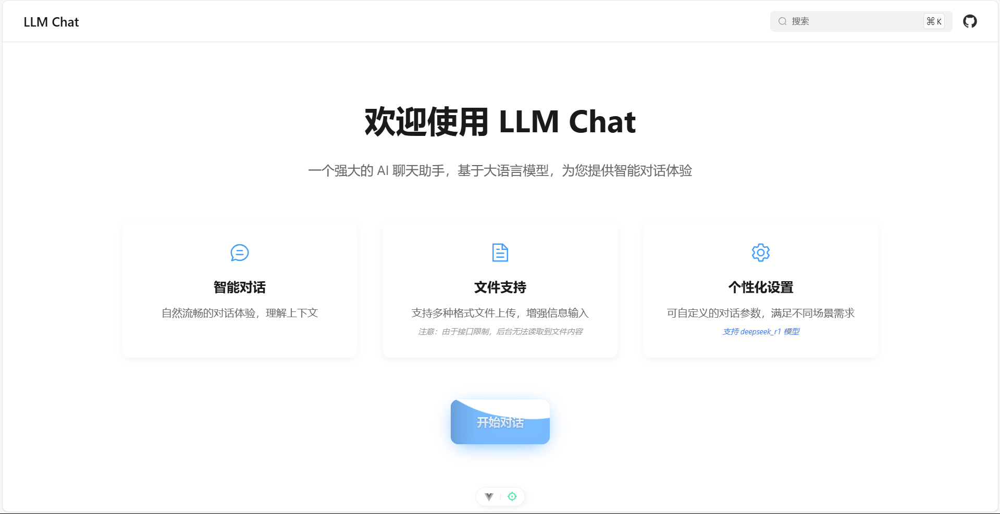
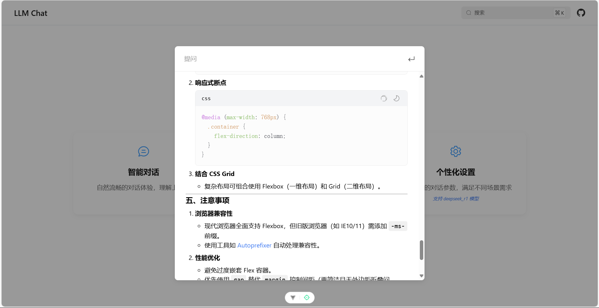

# LLM Chat

一个基于 Vue 3 + Vite + Element Plus 构建的轻量级 AI 聊天前端。

它面向 OpenAI 兼容接口，支持多会话管理、流式响应、System Prompt 预设、上下文摘要压缩、Markdown 安全渲染和本地持久化，适合作为 AI Chat 产品原型、个人项目基础模板或二次开发起点。

## 项目预览






## 项目特点

- 开箱即用的聊天前端：聚焦前端体验，不绑定后端实现，默认对接 OpenAI 兼容 `chat/completions` 接口。
- 多会话管理：支持新建、切换、重命名、删除会话，并自动保存到本地。
- 流式与非流式双模式：既支持逐段回填模型输出，也支持一次性展示完整回复。
- 上下文压缩：长对话达到阈值后自动生成摘要，减少历史消息带来的上下文负担。
- System Prompt 预设：内置通用助手、编程助手、写作助手、翻译助手，并支持自定义提示词。
- Markdown 渲染增强：支持标题、列表、表格、引用、图片、Emoji、链接和代码高亮。
- 安全渲染：模型输出经过 DOMPurify 净化，降低 `v-html` 场景下的 XSS 风险。
- 代码块体验完善：支持代码复制和局部明暗主题切换。
- 推理内容展示：兼容返回 `reasoning_content` 的模型，可折叠展示推理过程。
- 长列表性能优化：聊天消息区使用虚拟列表，减少长会话场景下的渲染压力。
- 首页快捷提问：首页内置轻量提问弹层，可作为独立入口快速试用接口。

## 技术栈

- Vue 3
- Vite 6
- Vue Router 4
- Pinia
- pinia-plugin-persistedstate
- Element Plus
- markdown-it
- highlight.js
- DOMPurify
- animate.css
- Sass

## 适合用来做什么

- 自建一个 OpenAI 兼容模型网关的 Web 聊天客户端
- 快速验证 LLM Chat 产品原型
- 作为 AI 问答、写作、翻译、编程助手类应用的前端基础工程
- 学习 Vue 3 下聊天式界面、流式响应和本地会话持久化的实现方式
- 在现有基础上继续扩展图片、多模态、服务端会话同步等能力

## 快速开始

### 1. 安装依赖

```bash
pnpm install
```

### 2. 配置环境变量

将 `.env.example` 复制为 `.env`：

填写接口基础地址：

```env
VITE_API_BASE_URL=https://api.siliconflow.cn/v1
```

说明：

- 项目默认请求 `${VITE_API_BASE_URL}/chat/completions`
- 当前仓库不内置后端代理
- API Key 通过页面右上角设置面板输入并保存在浏览器本地

### 3. 启动开发环境

```bash
pnpm dev
```

### 4. 构建生产版本

```bash
pnpm build
```

### 5. 本地预览构建结果

```bash
pnpm preview
```

## 常用脚本

```bash
pnpm dev       # 启动开发服务器
pnpm build     # 构建生产产物
pnpm preview   # 预览构建结果
pnpm lint      # 执行 ESLint 并自动修复
pnpm format    # 使用 Prettier 格式化项目
```

## 使用说明

首次进入聊天页后，建议先打开右上角设置面板完成以下配置：

- 填写可用的 API Key
- 选择模型
- 选择是否开启流式响应
- 调整 `Max Tokens`
- 选择预设角色或切换到自定义 `System Prompt`

设置项与聊天记录都通过 Pinia 持久化到浏览器本地，刷新页面后仍会保留。

## 接口兼容要求

前端默认按 OpenAI 兼容协议发起请求，请确保后端至少满足以下要求：

- `POST /chat/completions`
- `Authorization: Bearer <API_KEY>`
- `Content-Type: application/json`
- 请求体支持以下字段：
  - `model`
  - `messages`
  - `stream`
  - `max_tokens`

### 非流式响应

至少需要返回与 OpenAI Chat Completions 兼容的 JSON 结构，例如：

```json
{
  "choices": [
    {
      "message": {
        "role": "assistant",
        "content": "Hello"
      }
    }
  ],
  "usage": {
    "completion_tokens": 123
  }
}
```

### 流式响应

如果开启流式模式，后端需要返回 SSE 或等价格式的增量数据，前端会解析：

- `choices[0].delta.content`
- `choices[0].delta.reasoning_content`（可选）
- `usage.completion_tokens`（可选，用于速度展示）
- `[DONE]` 结束标记

## 核心实现说明

### 1. 会话与设置持久化

- 聊天会话保存在 `src/stores/chat.js`
- 设置项保存在 `src/stores/setting.js`
- 两个 store 都启用了 `pinia-plugin-persistedstate`

这意味着会话列表、当前会话、模型配置、API Key、System Prompt 等内容在刷新页面后都能恢复。

### 2. 聊天流程编排

`src/composables/useChatSession.js` 统一处理一轮完整对话流程：

- 写入用户消息
- 插入 assistant 占位消息
- 在达到阈值时压缩旧上下文
- 发起接口请求
- 根据流式或非流式模式回填最后一条 assistant 消息
- 支持“重新生成上一轮回答”

这样页面组件只关心展示和交互，不直接耦合请求细节。

### 3. 上下文摘要压缩

当有效消息数量超过窗口上限时，项目会：

- 保留最近一段消息作为活动上下文
- 将更早的消息整理成摘要请求
- 把摘要结果保存到当前会话的 `summary`
- 在后续正式对话请求前，把摘要作为额外的 system 消息补回上下文

这个实现比直接截断历史消息更稳妥，也更适合长对话场景。

### 4. Markdown 与代码块渲染

`src/renderers/markdown.js` 负责统一处理模型输出：

- 使用 `markdown-it` 进行 Markdown 转换
- 使用 `highlight.js` 做代码高亮
- 注入代码块复制与主题切换按钮
- 使用 `DOMPurify` 做最终净化

### 5. 消息列表性能优化

`src/components/VirtualMessageList.vue` 实现了一个轻量虚拟列表：

- 根据缓存高度和视口位置只渲染可见区域
- 使用 `ResizeObserver` 动态更新消息项高度
- 结合自动滚动逻辑，兼顾流式输出和长列表性能

## 项目结构

```text
src
├─ assets            # 图片资源与全局样式
├─ components        # 聊天气泡、输入框、设置面板、会话菜单等组件
├─ composables       # 自动滚动、聊天流程编排等组合式逻辑
├─ config            # 环境变量与接口地址配置
├─ constants         # 模型列表、默认设置、System Prompt 预设
├─ renderers         # Markdown 渲染与代码高亮
├─ router            # 页面路由
├─ services          # 聊天请求与响应解析
├─ stores            # 会话状态与设置状态
└─ views             # 首页、聊天页
```

## 当前边界

这个仓库目前是一个前端项目，下面这些能力还没有内置：

- 服务端代理或鉴权中转
- 用户登录与权限体系
- 服务端会话同步
- 图片上传与多模态消息
- 消息导出、搜索、分享
- 单元测试与端到端测试

如果你准备直接上线，建议根据实际场景补充服务端安全层、错误监控和测试体系。

## 二次开发建议

- 想接入新的模型供应商：优先复用 `src/services/chat/api.js` 的 OpenAI 兼容请求格式
- 想新增提示词模板：直接扩展 `src/constants/systemPrompts.js`
- 想修改模型列表与 token 上限：更新 `src/constants/models.js`
- 想调整消息编排或摘要策略：集中改 `src/composables/useChatSession.js`
- 想扩展 Markdown 展示能力：从 `src/renderers/markdown.js` 入手

## License

仓库当前未附带明确的 License。

如果你计划公开发布或接受外部贡献，建议补充 `LICENSE` 文件后再开源。
